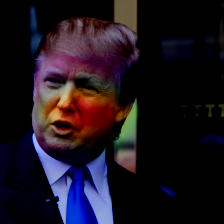

# Deepfake Image Detection with EfficientNet, FasterViT, and EfficientFormerV2


## Project Overview
This project detects deepfake images using modern CNN/ViT-family backbones. We use EfficientNet, FasterViT, and EfficientFormerV2-S1 to balance speed and accuracy, and to diversify architectures to reduce brittleness to dataset-specific artifacts. Models are integrated via `timm`, with reproducible training/evaluation and Grad-CAM visualizations.

Check out the research paper [here](https://docs.google.com/document/d/1Duh0sKFxBPB-_-t1U8HRtR3py7OVKb715McTbgyHh7Q/edit?usp=sharing)!

## Features
- **Multiple Backbones (via timm):** EfficientNet, FasterViT, and EfficientFormerV2-S1 for complementary accuracy/latency trade-offs.
- **Gradio Interface:** Simple web UI for uploading images and viewing model predictions.
- **Grad-CAM Visualization:** Heatmaps highlighting the regions driving model decisions (available across models).
- **Training & Evaluation Scripts:** Scripts for training and evaluation with Grad-CAM outputs. 

## Sample Predictions and Heatmap Visualizations
Here are a couple of examples of the model's output, along with heatmap visualizations for each.

### Deepfake Detection Example
**Mark Zuckerberg Deepfake**  
Predictions:  
EfficientNet: fake (62.11% confidence)  
FasterViT: fake (97.33% confidence)

<table>
  <tr>
    <td>
      <p><strong>Input Image</strong></p>
      
    </td>
    <td>
      <p><strong>Heatmap Visualization</strong></p>
      
    </td>
  </tr>
</table>

### Real Image Detection Example
**Donald Trump Real**  
Predictions:  
EfficientNet: real (97.83% confidence)  
FasterViT: real (98.55% confidence)

<table>
  <tr>
    <td>
      <p><strong>Input Image</strong></p>
      
    </td>
    <td>
      <p><strong>Heatmap Visualization</strong></p>
      
    </td>
  </tr>
</table>

## Installation
To set up the project, follow these steps:
1. **Clone the repository.**
2. **Install dependencies:** We use Python 3.12+  
   Install with:
   ```bash
   pip install -r requirements.txt
   ```

## Orchestrating runs (training & inference)

There are three main entrypoints, all routed through `orchestrator.py` and driven by YAML configs under `config/`:

- **`train.py`**: trains the models listed under `models:` in `config/train.yaml` (or a custom config).
- **`inference.py`**: runs batch evaluation using `config/inference.yaml`, logging metrics, plots, and confusion matrices.
- **`web_ui.py`**: launches a browser-based Gradio UI for single-image inference and Grad-CAM overlays, using the same config and `selection` as the orchestrator.

### Commands

1. **Train models listed in `config/train.yaml`:**
   ```bash
   python train.py
   ```

2. **Evaluate models defined in `config/inference.yaml`:**
   ```bash
   python inference.py
   ```

3. **Run the interactive web UI (Grad-CAM enabled):**
   ```bash
   python web_ui.py --config config/inference.yaml
   ```
   - Honors the YAML’s `models` and `selection` so the UI stays in sync with orchestrator runs.
   - Uses the per-model transforms and weight paths from the config (relative to the current working directory or absolute paths).
   - Exports CAM composites to `outputs/cam_exports/`.

Pass `--config` to any script to point at an alternate YAML while keeping the same structure.

Each run directory contains `checkpoints/` (latest & best checkpoints), `logs/` (console outputs), and `plots/` (confusion matrix and ROC curve when labels are available). The setup targets frame-level deepfake vs. real classification but works for multiclass `ImageFolder` datasets as well.

### Per-model transform toggles

Every transform in the training and evaluation pipelines can be toggled on or off per backbone. Add a `transforms:` block under each `models.<name>` entry in the YAML config and enable the transforms you need for training/inference for each model.